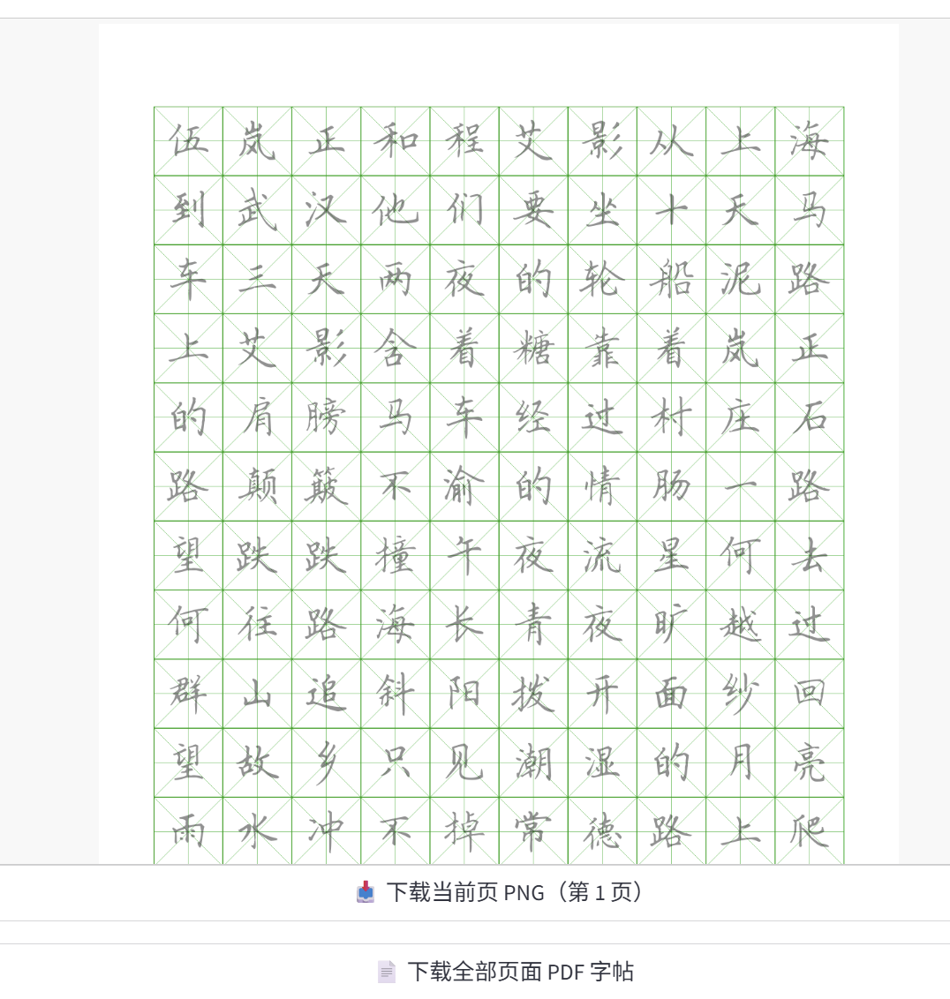

# 📚 田字格字帖生成器

一个基于 Streamlit 的 Web 应用，用于生成多种类型的汉字练习字帖。支持田字格、米字格、回宫格、方格、九宫格等多种格式，并可自动从 chinese-poetry 诗词数据库中选择内容生成字帖。



## ✨ 功能特性

- 🎨 **多种格子类型**：支持田字格、米字格、回宫格、方格、九宫格
- 📝 **灵活配置**：可自定义格子颜色、文字颜色、描红深浅、行列数等
- 🖋️ **字体支持**：支持自定义字体，默认从 `./fonts` 目录加载，也可使用系统字体
- 📄 **多页生成**：自动按 A4 纸张大小分页生成多页字帖
- 📚 **诗词集成**：集成 chinese-poetry 数据库，可直接选择诗词作为字帖内容
- 💾 **多种导出**：支持导出单页 PNG 或完整 PDF 文件
- 🎯 **两种模式**：
  - 普通模式：每行都有示范字
  - 临摹模式：每行示范字后留一空行供练习

## 🚀 快速开始

### 1. 安装依赖

```bash
pip install -r requirements.txt
```

### 2. 准备字体文件（可选）

将字体文件（`.ttf`、`.otf` 等格式）放入 `fonts/` 目录。如果不提供，程序会自动从系统字体目录中选择可用字体。

### 3. 准备诗词数据（可选）

如果需要使用诗词功能，需要先获取 chinese-poetry 数据：

```bash
# 方式1：使用应用内的克隆功能
# 在 Web 界面中点击"克隆 / 更新 chinese-poetry 仓库"按钮

# 方式2：手动克隆
git clone https://github.com/chinese-poetry/chinese-poetry.git ./chinese-poetry
```

### 4. 运行应用

```bash
streamlit run app.py
```

应用会自动在浏览器中打开（通常是 `http://localhost:8501`）

## 📖 使用说明

### 基本使用

1. **输入内容**：在文本框中输入要生成字帖的汉字、词语或句子
2. **选择格子类型**：选择田字格、米字格、回宫格等
3. **配置参数**：
   - 格子颜色：黑色、绿色、红色
   - 文字颜色：黑色、绿色、红色
   - 描红深浅：从"非常深"到"白色（不可见）"
   - 每行格子数和每页行数
   - 每个字重复次数
4. **选择字体**：在"字体设置"中展开，选择字体目录和具体字体
5. **生成字帖**：点击"✨ 生成字帖"按钮
6. **预览和下载**：在预览区域查看生成的字帖，可以下载单页 PNG 或完整 PDF

### 使用诗词功能

1. 展开"从 chinese-poetry 仓库选择一首诗/词填入字帖"部分
2. 如果还没有数据，点击"📥 克隆 / 更新 chinese-poetry 仓库"按钮
3. 选择数据集（如：全唐诗、宋词等）
4. 点击"🔍 从该数据集加载诗词列表"
5. 选择要使用的诗词索引
6. 点击"✅ 使用这首诗词作为字帖内容"按钮，诗词内容会自动填入主输入框

## 📁 项目结构

```
zitie/
├── app.py                 # Streamlit 主应用文件
├── dataloader.py          # 诗词数据加载器
├── requirements.txt       # Python 依赖项
├── README.md             # 项目说明文档
├── fonts/                # 字体文件目录
│   ├── tk.ttf
│   ├── STXINGKA.TTF
│   └── ...
└── chinese-poetry/        # 诗词数据库（可选）
    ├── loader/
    │   └── datas.json    # 数据集配置文件
    └── ...
```

## 🛠️ 技术栈

- **Python 3.x**
- **Streamlit** - Web 应用框架
- **Pillow (PIL)** - 图像处理和 PDF 生成
- **chinese-poetry** - 中文诗词数据库

## 📋 依赖项

- `Pillow~=9.1.0` - 图像处理库
- `streamlit>=1.28.0` - Web 应用框架

## ⚙️ 配置说明

### 字体配置

- 默认字体目录：`./fonts`
- 支持的字体格式：`.ttf`、`.ttc`、`.otf`
- 如果自定义目录中没有字体，程序会自动从系统字体目录中选择

### 诗词数据配置

诗词数据集的配置位于 `chinese-poetry/loader/datas.json`，包含以下数据集：

- 五代-花间集
- 五代-南唐
- 元曲
- 全唐诗全宋诗
- 四书五经-孟子
- 宋词
- 幽梦影
- 御定全唐詩
- 曹操诗集
- 楚辞
- 水墨唐诗
- 纳兰性德
- 论语
- 诗经

## 🎨 功能演示

### 格子类型示例

- **田字格**：外框 + 中间十字
- **米字格**：外框 + 米字对角线 + 中心十字
- **回宫格**：类似回字结构，多层嵌套
- **方格**：简单的外框
- **九宫格**：3x3 内部分格 + 外框

### 描红模式

- **显示示范字**：在格子中显示浅色示范字（描红）
- **只练字格**：取消勾选"显示示范字"，只显示空白格子

## 📝 注意事项

1. 首次使用诗词功能时，需要先克隆 chinese-poetry 仓库（可能需要一些时间）
2. 生成大量页面时，可能需要一些时间，请耐心等待
3. 字体文件较大时，加载可能需要一些时间
4. 建议使用支持中文的字体，否则可能无法正常显示汉字

## 🤝 贡献

欢迎提交 Issue 和 Pull Request 来改进这个项目！

## 📄 许可证

本项目使用 MIT 许可证。

## 🙏 致谢

- [chinese-poetry](https://github.com/chinese-poetry/chinese-poetry) - 提供中文诗词数据库
